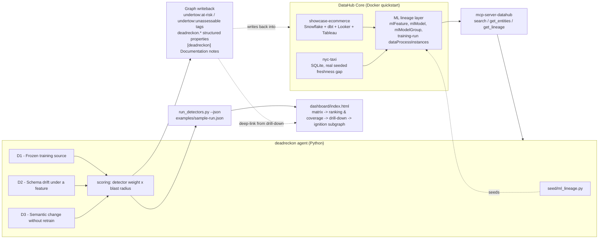

# deadreckon

**Build with DataHub: The Agent Hackathon — Challenge #3, Production ML Agents**

## The problem

Models in production rarely fail loudly. They fail quietly: a serving
metric still looks normal, the pipeline still runs on schedule, nothing
pages anyone — and four hops upstream in the data chain, a column got
renamed, a table stopped refreshing, or a transformation's logic changed
underneath the feature the model was trained on. ML monitoring and data
monitoring are usually two separate systems, and the silence between
them is exactly where the money goes missing. Nobody connects the table,
the feature, the training run, and the deployed endpoint, because no
single system owns that whole chain.

## What deadreckon does

deadreckon is an agent that walks a model's full lineage in DataHub —
dataset → feature → training run → model → deployment — using
**metadata only**. No model runtime, no serving access, no drift
computed on live predictions. That's a design constraint, not a
shortcut: it's the thesis of the project. If a silent failure can't be
caught from the metadata graph alone, no amount of runtime monitoring
downstream will tell you *why* it started.

Three detectors look for three distinct classes of silent failure:

| Detector | Catches | Example finding |
|---|---|---|
| **D1 — Frozen training source** | An upstream dataset stopped receiving real updates, but training keeps firing on schedule anyway. | *"taxi_eta_predictor_v1 trains nightly on a source frozen for 9 days."* |
| **D2 — Schema drift under a feature** | A feature's source column disappeared from the schema after the model's last training run — serving now reads nulls. | *"customer_credit_limit points at a column missing for 3 days; last trained before the schema changed."* |
| **D3 — Semantic change without retrain** | An upstream dbt/Spark transformation's logic changed after the last training run — same schema, different meaning. | *"order_details's discount_percent definition changed 9 days ago; the model still assumes the old one."* |

Each detector reaches one of **three states**, not two: `PASS`,
`FINDING`, or `INSUFFICIENT_DATA`. That third state is the axis the
whole project turns on. "We checked and it's fine" and "we had nothing
to check with" are different claims, and collapsing them into one is
precisely the kind of silent failure this project exists to catch.
`INSUFFICIENT_DATA` never moves a model's risk score. It's reported
separately, as coverage.

### Coverage: an independent signal, not a footnote

Risk and "did we actually get to check" are two different questions,
and folding the second into the first destroys the meaning of both. A
model that scores `0.0` because every detector ran and found nothing is
in a completely different situation from a model that scores `0.0`
because every detector was missing the metadata it needed — both are
`0.0`, and **coverage is the only thing that tells them apart.**

deadreckon tracks this explicitly as `deadreckon.assessmentCoverage`
(e.g. `"2/3"`, conclusive detectors over total), written back to the
graph and surfaced everywhere in the dashboard as a first-class,
equally-weighted signal next to risk — never as a muted afterthought. A
model can legitimately have low risk *and* low coverage at the same
time, and that combination is not the same as "safe."

### Writing back into the graph, not just reading it

Reading lineage is necessary but not sufficient — a risk assessment
that lives only in a local JSON file never reaches the person who owns
the model. So every run writes its findings back into DataHub, next to
the model they concern:

- **`undertow:at-risk`** tag — applied only when severity is `MEDIUM`
  or `HIGH` (never just "has a finding"), and *removed* automatically
  if a later run finds the model has recovered, so the tag always means
  "currently at risk," not "was ever flagged once."
- **`undertow:unassessable`** tag — a separate, rarer flag for models
  where *every* detector came back `INSUFFICIENT_DATA`: not a finding
  about the model, but an admission that the metadata needed to govern
  it isn't there at all.
- **`deadreckon.riskScore` / `deadreckon.lastAssessedAt` /
  `deadreckon.findingCount` / `deadreckon.assessmentCoverage`**
  structured properties on the model, updated every run.
- A **"Model Risk Assessment" document**, plus one `[deadreckon]`
  entry per finding under the model's own Documentation tab —
  including, deliberately, an entry for the fully-clean case ("CLEAR —
  all 3 detectors checked, nothing found") and for the unassessable
  case ("NOT ASSESSED — no detector had the metadata it needed"), so a
  human looking at the model's page in DataHub sees the same three-state
  honesty the dashboard shows, without leaving DataHub at all.

This is the part of the project most directly aimed at this
hackathon's own "contribute back to the graph" criterion, and it's
designed to be seen, not just asserted in a README — the dashboard's
own deep-links land exactly here.

## Architecture



Read via `mcp-server-datahub`'s tools (`search`, `get_entities`,
`get_lineage`, `get_lineage_paths_between`); write via the same GraphQL
mutations those tools' mutating counterparts use, called directly so
the pipeline runs headlessly. See `NOTES.md` for exactly which native
fields this MCP server does and doesn't project for ML entity types,
and why several writeback fields ended up as structured properties
instead of native ML-specific fields as a result.

## Try it

### See the dashboard — 0 seconds of setup

```
Double-click dashboard/index.html.
```

That's it. No Docker, no server, no `npm install`. The dashboard is a
single self-contained static HTML file with a real sample run
(`examples/sample-run.json`) embedded directly in it, so it shows real
data the instant it opens in a browser. It has four views, built in
this order:

1. **Matrix** — all 5 seeded models × the 3 detectors, three visually
   distinct states per cell (not color alone — every state also has its
   own shape/icon, since red and orange blur together after video
   compression), risk and coverage both shown with their ceiling
   (`risk=X/3.0`, `N/3`), and a permanent banner whenever a loaded run
   used a shifted clock.
2. **Ranking & Coverage** — risk and coverage plotted as two genuinely
   independent axes, with the low-coverage band explicitly labeled
   *"Unverified — not the same as safe."* Drop in
   `examples/sample-run-edge-cases.json` (drag-and-drop, or the file
   picker in the header) to see a model land in that zone live.
3. **Drill-down** — click any cell, including `PASS` and
   `INSUFFICIENT_DATA` ones, for the full reasoning, the evidence
   (rendered per-detector, since the three detectors' evidence shapes
   genuinely differ), and a deep-link to the real entity in DataHub —
   only ever to entities with a route this project actually verified;
   see [`docs/output-schema.md`](docs/output-schema.md) for exactly
   which entity types that covers and why.
4. **Ignition subgraph** — the narrow path from the point a finding
   actually originates to the model, annotated with *why* that node is
   the ignition point — deliberately not a reproduction of DataHub's
   own lineage graph, just the one thing that graph view doesn't say.

See [`dashboard/README.md`](dashboard/README.md) for more detail on
each view.

### Run the full agent from scratch — for verifying the backend

The dashboard above is enough to see the project's output. To verify
the agent itself against a live DataHub instance:

**Requirements:** Docker Desktop with **at least 8 GB RAM** allocated
(Settings → Resources → Memory, then *Apply & restart* — see
[Prerequisites](#prerequisites) below for why), Python 3.10+, and `uv`.

```bash
# 1. Stand up DataHub Core (quickstart), with the OpenSearch zombie-reaping
#    fix this repo ships (see "Known issue" below):
datahub docker quickstart \
  -f ~/.datahub/quickstart/docker-compose.yml \
  -f docker-compose.opensearch-init.yml

# 2. Load showcase-ecommerce (Snowflake/dbt/Looker/Tableau, 1049 entities):
datahub datapack load showcase-ecommerce

# 3. Install deadreckon's own dependencies:
uv sync

# 4. Seed the ML lineage layer + the disclosed D2/D3 faults (see "Demo
#    honesty" below), then run the agent:
uv run python seed/ml_lineage.py
uv run python seed/inject_faults.py
uv run python run_detectors.py --matrix --json examples/sample-run.json
```

D1's fixture (`nyc-taxi`) is third-party
([`datahub-project/static-assets`](https://github.com/datahub-project/static-assets),
`datasets/nyc-taxi`) and isn't redistributed in this repo — see
`.gitignore`. Clone it separately and follow its own ingest recipe; two
upstream bugs you'll hit along the way are already diagnosed with
working fixes in `NOTES.md` (a `max_overflow`/SQLite pooling crash when
profiling is enabled, and `add_metadata.py` silently overwriting all but
the last tag/term per table — this repo's `seed/fix_nyc_taxi_tags.py`
fixes the second). Once it's loaded, run `seed/nyc_taxi_freshness.py`
against it to make the fixture's real freshness gap visible in
DataHub's metadata (`operation` aspects), which is what D1 actually
reads — see that script's own docstring for why the gap isn't visible
without this step, and `NOTES.md` for how the real gap size (9 days) was
verified against the fixture's own stated (and incorrect) "3 days".

`run_detectors.py` fetches every model's lineage through
`mcp-server-datahub`'s read tools, runs D1–D3, scores and ranks the
results, writes everything back into the graph (tags, structured
properties, the Documentation notes described above), and can emit the
same JSON the dashboard reads (`docs/output-schema.md`, frozen at
`v1.0.0`). Add `--dry-run` to skip writeback, `--as-of <ISO timestamp>`
to assess against a shifted clock (see "Determinism" below).

## Determinism and the clock

Freshness is inherently wall-clock relative, so every seed script
anchors its timestamps to the moment it runs, not to a fixed date —
otherwise a demo recorded today reads "12 days stale" and the same
demo run next month reads "47 days stale" purely because time passed.
`DEADRECKON_NOW` (or `run_detectors.py --as-of`) overrides "now" for
both seeding and detection, specifically so the determinism claim is
testable rather than asserted: seed and assess, shift the clock,
re-seed and re-assess, and the resulting model × detector matrix comes
out identical.

When a run's clock was overridden this way, `run.clock_overridden` in
the JSON output is `true`, and **the dashboard treats this as a
permanent, unmissable banner on every view** — not a small technical
warning, a deliberate honesty feature. A dashboard that could silently
present a rehearsal run as a live one would be exactly the kind of
quiet misrepresentation this entire project exists to catch, so it
doesn't get an exception for itself.

## Demo honesty

D1's frozen-source signal comes entirely from a real gap already
present in the community-shipped `nyc-taxi` fixture —
`seed/nyc_taxi_freshness.py` only makes that gap visible in DataHub's
metadata, it doesn't create it (see `NOTES.md` for why the gap wasn't
metadata-visible as shipped, and how its real size was verified).

D2 and D3 detect classes of failure — a column silently disappearing, a
transformation's logic changing under a model — that a static fixture
snapshot has no history of by default. Verifying a detector against a
failure mode requires a controlled instance of that failure mode: a
real production incident isn't reproducible on demand, and a detector
that's only ever run against whatever happened to already be in the
data hasn't been tested against the thing it claims to catch.
`seed/inject_faults.py` exists for exactly this reason — it plants a
real column rename (`customers.credit_limit` → `credit_limit_usd`) and
a real dbt view-logic edit (`order_details.discount_percent`, same
column name and type, denominator changed), so D2 and D3 can be
exercised against an actual instance of the failure they're built to
catch, on a schedule a demo can rely on. The exact edits, timestamps,
and diffs are documented in full in `NOTES.md` — the fixture's
provenance is as inspectable as the detector's output.

## Prerequisites

**Allocate at least 8 GB of RAM to Docker, and keep 13 GB of free
disk.** (On Colima: `colima start --memory 8`.) This is higher than the
`datahub` CLI's own 4.3 GB preflight check — with `showcase-ecommerce`
loaded, the six quickstart containers measurably idle at ~4.23 GiB
combined, already over that threshold before any indexing work; see
`NOTES.md` for the full measurement and the upstream issue filed about
it.

### Known issue: OpenSearch dies about once a day

Unrelated to memory — a zombie-process leak in the quickstart's
`opensearch` healthcheck, confirmed and filed upstream as
[datahub-project/datahub#18657](https://github.com/datahub-project/datahub/issues/18657#issuecomment-5108977744).
This repo ships the fix as an overlay compose file
([`docker-compose.opensearch-init.yml`](docker-compose.opensearch-init.yml)),
used in the quickstart command above. Recovery if it does die before
you apply the overlay: `docker start datahub-opensearch-1` — data lives
in a volume and survives.

## Examples

- [`examples/sample-run.json`](examples/sample-run.json) — a real dump
  of the seeded fixture: 5 models, every detector state, both a
  flagged and a fully-clean control model
  (`taxi_fare_predictor_v1`, `PASS`/`PASS`/`PASS`).
- [`examples/sample-run-edge-cases.json`](examples/sample-run-edge-cases.json) —
  synthetic, through the same serializer, covering states the real
  fixture can't reach: a finding on a model that is *not* at-risk, and
  a fully unassessable model.
- Full machine-readable contract: [`docs/output-schema.md`](docs/output-schema.md)
  (frozen at `v1.0.0`).

## Upstream contributions

Issues found while building this and reported back to DataHub:

- **[#18657](https://github.com/datahub-project/datahub/issues/18657#issuecomment-5108977744)** —
  OpenSearch dies about once a day on a stock quickstart (zombie-process
  reaping, not a memory problem — includes correcting our own earlier
  misdiagnosis). Fix shipped here as `docker-compose.opensearch-init.yml`.
- **[#18675](https://github.com/datahub-project/datahub/issues/18675#issuecomment-5108983658)** —
  standalone `Document` entities have no working profile route
  anywhere in this DataHub version's frontend, confirmed two
  independent ways. This is why deadreckon's own writeback surfaces its
  reasoning through `institutionalMemory` notes on the model itself
  rather than relying on a document link a judge could click into a
  404.

Further material collected but not yet filed (MCP read gaps for
`mlModelDeployment`/`mlModel`/`mlFeature`/`dataProcessInstance`) is
written up in [`NOTES.md`](NOTES.md).

## License

Apache License 2.0 — see [LICENSE](LICENSE).
